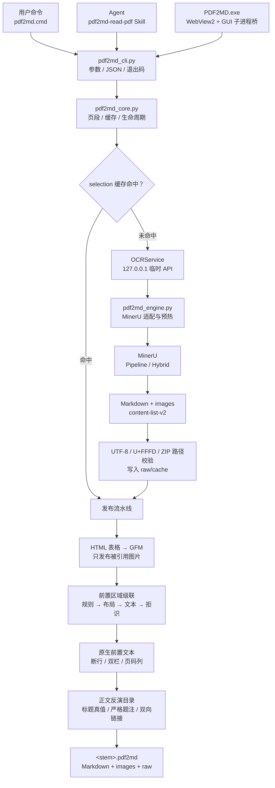

# PDF2MD

Windows 本地 PDF → Markdown 工具，面向两种使用方式：人在桌面 GUI 中转换，或 AI Agent 通过 CLI/Skill 先把 PDF 转成 Markdown 再阅读。

项目只处理 PDF，公开结果只保留一个 Markdown 和图片目录。OCR 必需的缓存、日志与分段结果统一放进 `raw/`。

## 架构与端到端 OCR 流程

PDF2MD 只有一条生产转换链。CLI、GUI 和 Agent Skill 只是不同入口，最终都进入 `src/pdf2md_cli.py` 与 `src/pdf2md_core.py`；没有隐藏的第二套 OCR 或发布实现。



模型、Python 匹配代码与 MinerU 内部调用顺序的实现级说明见 [识别模型、匹配代码与执行流程](docs/recognition-models-and-pipeline.md)。

### 分层职责

| 层 | 主要文件 | 只负责什么 |
|---|---|---|
| 入口 | `pdf2md.cmd`、`pdf2md_cli.py` | 参数解析、单文件/`batch`/`preload` 分派、JSON 契约和退出码 |
| 会话与状态机 | `pdf2md_core.py` | 校验输入、页段、缓存、OCR 服务生命周期、结果验证和发布 |
| MinerU 适配 | `pdf2md_engine.py` | 安装 span 修复、INDEX/布局元数据保真与模型预热路由，然后启动 MinerU API |
| Markdown 规范化 | `pdf2md_markdown.py` | 只负责把可安全解析的 HTML 表格转换为 GFM 表格 |
| 前置页理解 | `pdf2md_front_regions.py`、`pdf2md_region_*.py` | 规则、布局/文本分类、相邻页融合、拒识和 V1 兼容投影 |
| 原生前置文本 | `pdf2md_frontmatter.py` | 从所选物理页的 PDF 文本层提取目录候选并独立缓存 |
| 导航构建 | `pdf2md_toc.py` | 以正文标题/题注为真值，融合原目录顺序并建立安全双向链接 |
| GUI | `pdf2md_gui.py`、`ui/` | 本地 WebView2 交互和进程桥，不实现 OCR |
| Agent | `skills/pdf2md-read-pdf/` | inspect/search、最小页集选择、调用 CLI 和按需阅读结果 |

### 一次转换从输入到发布

1. **统一入口**：CLI 将单文件参数解析为 `ConversionOptions`。GUI 每次任务启动同一个 CLI 的 JSON 模式；Skill 先 inspect/search，再把最小相关物理页交给 CLI。
2. **输入与页码校验**：核心解析绝对路径、确认扩展名为 PDF、验证 profile/method/timeout，并把 `1,3,5-8` 拆成有序物理页段。局部页会先读页数，越界在启动模型前失败。
3. **输出隔离**：默认目标是源 PDF 同级的 `<stem>.pdf2md`。核心拒绝让输出目录覆盖源文件，并把公开结果、内部缓存、selection、日志和清单分开。
4. **内容寻址**：manifest 记录源 PDF 的解析路径、大小、修改时间和 SHA-256；大小或时间变化会触发重新计算哈希。selection 任务键绑定记录的 SHA-256、物理页段、profile、解析方法、语言和缓存版本；`--force` 显式绕过匹配缓存。若外部程序在保持大小与修改时间完全不变的情况下改写字节，应使用 `--force`。
5. **先查缓存**：每个页段独立查 `raw/manifest.json`。普通单文件命令全部命中时不会启动 OCR，但仍会重新执行当前版本的表格、图片、前置区域和目录发布逻辑，所以后处理升级不要求整本重识别。`batch`/`preload` 的服务启动时机见下面的模型生命周期说明。
6. **按需启动本地引擎**：普通单文件命令在首个 cache miss 时才创建 `OCRService`。服务选择随机空闲端口，只监听 `127.0.0.1`，客户端禁用代理继承；核心轮询健康状态、上传 PDF、轮询任务并下载结果 ZIP。
7. **选择解析后端**：

   | profile | MinerU 后端 | effort | 图表分析 | 适用场景 |
   |---|---|---|---|---|
   | `fast` | Pipeline | medium | 关闭 | 快速检查、资源紧张、文本层较好 |
   | `balanced` | Hybrid | medium | 关闭 | 默认；论文、手册、datasheet |
   | `accurate` | Hybrid | high | 开启 | 图表语义或复杂版面确实重要 |

   `--method auto` 让引擎选择文本层或 OCR，`txt` 偏向原生文本，`ocr` 强制 OCR。公式与表格识别保持启用；`balanced` 关闭的是额外图表语义分析，不是表格提取。
8. **同一次推理保留结构证据**：OCR API 只请求 Markdown、实际图片和轻量 `content-list-v2`。适配层保留 PP-DocLayoutV2 的 label、score、bbox、阅读顺序和 INDEX 行；Pipeline、Hybrid/VLM 走同一元数据契约。不会请求或发布 `middle.json`、`model.json`、原 PDF 副本和可视化调试包。
9. **字符修复**：MinerU 生成文本时先利用 PDF 字体映射修复位置确定的单字符；仍有问题时只裁剪受影响 span 做后置 OCR。结果若仍含 Unicode 替换字符 `�`，本页段失败且不写入可复用 selection，避免把损坏文本静默发布。
10. **安全接收与缓存**：核心以流式方式下载 ZIP，校验解压路径不能逃出临时目录，读取 Markdown/图片/content-list，然后按任务键写入 `raw/cache/` 与 `raw/cache/selections/`，更新 manifest，最后删除任务临时目录。
11. **合并和公开格式整理**：多个页段先规范化为不重叠、按物理页递增的区间，再按这一顺序合并，并保留 `PDF pages ...` 边界；HTML 表格转成 GFM 表格。公开 `images/` 每次由缓存重建，只复制 Markdown 实际引用的图片并按首次引用编号。
12. **前置区域识别**：只有一个连续 selection 且存在合法 `content-list-v2` 时才运行结构化前置页级联。分类器最多检查前 64 个物理页，依次使用可证明的高置信规则、现有 PP-DocLayoutV2 框上的布局头、仅低置信页使用的 OCR 文本头、相邻页序列约束；仍不确定就拒绝输出这一结构证据。拒识不会屏蔽 Markdown 中本来就有的显式 `Contents` 等导航标题；非连续页段也不会跨缺页推断。
13. **原生文本与正文反演融合**：被接受的目录/图目录/表目录提供“这个块属于导航、条目顺序和层级”的参考；原生 PDF 文本层补断行、双栏和页码列。正文显式 Markdown 标题与严格 Figure/Table 题注才是链接目标和规范标题。前置内容不能单独制造正文目标。
14. **安全目录发布**：目录块先按整体结构确定所有权，再替换其文本范围；条目匹配与块删除分离。有编号条目必须同号，正文目录与图/表类型不得混配；匹配遵循当前块确定的方向和游标，候选不唯一或 margin 不足就只保留无链接条目。目录 section anchor 和正文 target anchor 自身带 `data-pdf2md-nav`；若题注标题由系统生成，前一个 target anchor 还带 `data-pdf2md-heading="generated"`。反链与标题行本身不带属性，清理时只接受它们紧邻 owned anchor/heading 的严格位置和格式。二次运行只清理能证明属于自己的节点。
15. **写出结果**：最终 Markdown 先写 `.md.tmp` 再原子替换顶层文件；若本次 OCR 服务产生日志，则更新 `raw/logs/last-run.log`，全缓存命中不会伪造新日志。公开 `images/` 会先清空再由缓存重建，它与 Markdown 替换不是一个跨目录事务；若进程在发布中途被强制终止，应直接重跑，命中的 OCR 缓存会重新完成发布。OCR 或验证在发布前失败时不会用损坏 Markdown 覆盖成品，调试与缓存继续留在 `raw/`。

### 模型与 GPU 生命周期

- 普通单文件命令若全部 cache hit，不会启动 OCR 服务；出现首个 miss 才加载模型，同一文件的所有页段共用一个进程，命令结束后终止该进程树并释放 GPU。
- `batch` 使用一个固定 profile、method、language 的 `ConversionSession`：默认只启动服务，遇到首个 cache miss 才懒加载模型；指定 `--load-model` 时会在检查队列缓存前显式预热，即使随后全部命中也会加载一次。
- `preload/session` 进入会话时立即预热模型，并在多次 `convert`/`batch` 间保持驻留。正常 `exit`、EOF、`Ctrl+C` 和代码可捕获的异常路径会统一清理；任务管理器强杀、进程崩溃或断电无法保证执行 finally。
- GUI 当前每次点击转换都会新建一个 CLI 子进程，因此不同 GUI 任务之间还不复用驻留模型；大量测试或批量转换应使用 CLI `batch`/`preload`。

### 前置分类模型的当前状态

运行时只会尝试加载 `models/front-region/v1/layout.json`、`text.json` 和同目录 `policy.json`。policy 必须使用 `pdf2md.region-cascade-policy.v1` schema，明确 `approved_for_auto_action=true`、`experimental=false`，且 `experiment_only` 不能为 true，并给出两个模型的 64 位 SHA-256。生产 artifact 必须是 JSON；各自 metadata 还必须满足 `approved_for_auto_action=true`、`experimental=false`、`experiment_only` 不为 true、`training_eligible=true`、`redistributable=true`，实际哈希必须与 policy 完全相等。任何一项不满足就退回规则模式。

当前本地工作目录只有 `models/front-region/candidate/` 实验候选，策略为 `approved_for_auto_action=false`，没有生产 `v1/`，所以**前置区域级联**当前走 rules-only；MinerU、PP-DocLayoutV2、公式/表格与 OCR 本身仍然使用模型。训练器可额外生成 `navigation-layout.npz`/`navigation-text.npz`，但它们只用于离线评测，生产 loader 不读取。

## 最终输出

默认在 PDF 同级创建 `<pdf-stem>.pdf2md`：

```text
D:\docs\paper.pdf
D:\docs\paper.pdf2md\
├─ paper.md              # 唯一需要阅读的全文/选定页 Markdown
├─ images\               # Markdown 实际引用的图片
└─ raw\                  # 内部缓存、日志、索引和清单
```

CLI 请求 OCR 引擎时只请求 Markdown、图片，以及用于前置区域判断的轻量 `content-list-v2`。后者只保存在 `raw/cache/content-lists/`，不会成为 Agent 的阅读入口。以下大型或重复上游产物仍不请求：

- `middle.json`
- `model.json`
- 原始 PDF 副本
- 可视化或调试文件

`raw/` 不是公开阅读接口。Agent 正常情况下只读顶层 `.md`，确有需要才查看 `images/`。

### 表格、公式与图片

- MinerU 返回的 `<table><tr><td>…</td></tr></table>` 会在最终发布阶段转成 GFM Markdown 管道表格，不把 HTML 表格暴露给 Agent。单元格内的 LaTeX 公式和图片引用会保留。
- GFM 表格不支持 `colspan`/`rowspan`：PDF2MD 会展开为规则矩形网格，跨列分组标题用加粗行表示，跨行位置用空白占位。无法安全解析的异常表格保留原始内容，不猜测或丢弃数据。
- OCR 能识别的行内公式和独立公式直接写成 Markdown 中的 LaTeX：`$...$` 或 `$$...$$`。
- 顶层 `images/` 只发布 Markdown 实际引用的图、照片、结构图等视觉内容，并按正文首次引用顺序命名为 `1.png`、`2.jpg`、`3.png`……；Markdown 图片链接同步使用这些名称。
- OCR 过程中生成但 Markdown 未引用的公式裁剪图、版面切块等只保存在 `raw/cache/images/`，不会污染公开图片目录。
- 转换层会严格检查 UTF-8 和 Unicode 替换字符 `�`。Hybrid 与 Pipeline 共用同一修复链：先按 PDF 字体对齐 PyPDF 的备用文字映射，直接恢复位置确定的单个数学字符；只有仍无法恢复的文本 span 才裁剪该 span 的边界框并执行后置 OCR，不会重跑整页或整个页段。
- 旧缓存中含 `�` 时会失效并用局部修复引擎重建一次。如果字符映射和 span OCR 后仍存在 `�`，任务会明确失败并保留原有公开结果，不会静默覆盖成品；此时可只对受影响的小页段显式使用 `--ocr` 作为最后手段。
- 如果 Markdown 本身仍引用一张公式图片，说明该公式在这次解析中没有可靠转换为 LaTeX；只有它影响理解时，才改用 `accurate` 重试或按 Skill 的局部纠错流程核对原页。

### 目录与章节导航

- PDF2MD 会识别中文/英文正文目录、图目录、表目录、续页标题及常见书籍目录标题。正文中已经存在的 Markdown 标题是结构真值，前置目录负责决定应收录的条目与顺序；PDF2MD 不会把正文所有小标题盲目加入目录。OCR 丢失章号时，可由唯一的 `Chapter N` 与相邻正文标题补回。
- OCR 同一遍转换会保留 `content-list-v2` 中的物理页、块类型、边界框、阅读顺序、PP-DocLayoutV2 原始标签/分数和 INDEX 条目；Hybrid 原先会降级为普通段落的 INDEX 也会在内部清单中恢复。前置页先走可证明的高置信规则，再聚合现有布局检测框；只有边界样本才用同一次转换已有的 OCR/原生文本做轻量字符 n-gram 复判，不会再次 OCR。最终仍不确定时，该页级决策拒识，不把候选块作为已接受的结构证据；Markdown 中已有的显式导航标题仍可由保守解析器处理，“显式标题 + 不可用点线残骸”还可只授权同页原生文本恢复。带分类器指纹的 V2 缓存位于 `raw/cache/front-regions/<task-key>/<fingerprint>.json`，保存接受/拒识决策、top candidates、紧凑 block 证据和布局元数据；兼容投影 `raw/cache/front-regions-v1.json` 只保存已接受页的 kind/confidence/evidence/stats、合并区域、导航文本块和受限原生恢复信号。两者都不能越过正文标题的严格匹配规则自行造链接。
- 全文转换时只检查 PDF 前置区，最多 64 个物理页，并在离开目录区后提前停止。仅当 selection 从物理第 1 页开始时，前 3 页内的首个 datasheet 正文候选才可能延后；系统会在前 8 页寻找高置信显式导航，再从导航后最多 12 页内寻找第二个正文边界。高质量原生文本层用于补充断行、双栏粘连、点线和页码错位；文本层不可用的扫描版则让前置 OCR 条目与正文显式标题按顺序交叉验证。正常导航块按自身结构接管；至少 3 条、支持率至少 75% 的块级门槛只用于把初始目录后面的可疑尾部扩展为 owned range，严格点线尾部另有更窄的结构分支。个别无法唯一链接的条目保留为纯文本目录项，代码、缩进正文、编号回退和普通段落都是硬边界。原生前置文本按精确页选择缓存为 `raw/cache/frontmatter-v8-<pages>.json`，不会反复扫描。
- 最终目录只保留名称和层级，不显示原 PDF 目录页码。章、`1.1`、`1.1.1` 按编号深度逐级缩进；标题折行、单空格页码、罗马页码、字距异常和续页会在前置页解析器中保守合并。
- 正文目录只能链接到原文已经存在的 `#` 到 `######` Markdown 标题。普通正文行即使文字相同也不会被提升或作为链接目标；编号条目必须匹配同一编号，`1` 与 `A.1`、章节与图表也不会跨类型匹配。无编号标题只会在当前目录块确定的 before/after 方向、游标范围和尚未占用的候选集中选取唯一优胜者；前两名分差小于 0.08 时拒绝链接。
- 图目录和表目录按 `Figure/Table + 编号` 精确匹配。只有严格的正文图题或表题会补成紧凑的六级 Markdown 标题；正文引用、代码块、重复且无法消歧的编号不会提升。若 OCR 把图表目录压成超长点线乱码，可在确有源目录时用正文图题/表题重建；没有源目录则不凭空生成。
- 目录使用标准 Markdown 链接，如 `[1.1 Overview](#2)`；目标前写入带所有权标记的稳定数字锚点 `<a id="2" data-pdf2md-nav="target"></a>`。正文标题同时生成 `[↑ Contents](#toc)` 反链，图题和表题分别返回图目录、表目录；正文目录中的 `List of Figures/Tables` 也会与对应目录建立双向链接。
- 数字目标锚点只为实际匹配的标题按正文顺序连续编号。目录区使用 `toc`、`list-of-figures`、`list-of-tables`（组合图表目录使用 `list-of-figures-and-tables`）语义锚点；若与用户已有锚点冲突会自动换名，二次发布只清理 PDF2MD 自己标记的节点，不删除用户 HTML 锚点或手写链接。
- 局部页转换不会注入完整 PDF 的目录，避免无目标链接与额外 token。只有单个连续页段本身包含已接受的导航区，或出现“显式目录标题 + 不可用点线残骸”的恢复证据时，才读取该页段内的原生文本；未选择页、正文单页和不连续页段一律不参与。无法找到唯一安全目标的条目保留为纯文本，不猜测；没有源目录的文档也不会自动插入长目录。
- 这些处理都发生在最终 Markdown 发布阶段，缓存命中同样生效，不启动 OCR。开发者可运行 `.\runtime\env\python.exe .\scripts\audit-navigation.py <目录> --idempotent` 检查重复/失效锚点、正反链一致性、异常长目录行和字节级幂等性。

PDF2MD 的公开命令、文件名、界面和 Skill 均使用 `PDF2MD` 品牌。安装依赖中的 `mineru` Python 包名和 `MINERU_*` 环境变量属于第三方 OCR 引擎的固定技术接口，不能在不分叉上游源码的情况下改名，也不会暴露为用户操作入口。PDF2MD 通过当前环境的 Python 模块启动上游引擎，不依赖会固化安装路径的控制台 `.exe` 启动器，因此项目根目录可以改名或整体移动。

## 快速使用

### 命令行

`pdf2md.cmd` 不受 PowerShell 脚本执行策略限制。

```powershell
# 完整 PDF
.\pdf2md.cmd "D:\docs\paper.pdf"

# 只转换物理 PDF 第 3 页
.\pdf2md.cmd "D:\docs\paper.pdf" --page 3

# 连续或非连续页段
.\pdf2md.cmd "D:\docs\paper.pdf" --pages "1-3,8,12-15"

# 机器可读输出，适合 Agent 或自动化
.\pdf2md.cmd "D:\docs\paper.pdf" --pages "3-8" --json

# 一个进程连续转换整个目录；首项加载后，后续 PDF 复用同一套 GPU 模型
.\pdf2md.cmd batch "D:\docs" --recursive

# 在处理队列前显式预热模型；适合测试和大量 PDF
.\pdf2md.cmd batch "D:\docs" --recursive --load-model

# 先加载模型并进入前台会话
.\pdf2md.cmd preload --profile balanced --method auto
# PDF2MD> convert "D:\docs\paper.pdf" --pages 3-8
# PDF2MD> batch "D:\docs" --recursive
# PDF2MD> exit

# 查看参数
.\pdf2md.cmd --help
.\pdf2md.cmd batch --help
.\pdf2md.cmd preload --help
```

也可以直接运行 Python CLI：

```powershell
.\runtime\env\python.exe .\src\pdf2md_cli.py "D:\docs\paper.pdf" --json
```

常用参数：

| 参数 | 作用 |
|---|---|
| `-o, --output` | 指定输出目录；默认使用 PDF 同级 `<stem>.pdf2md` |
| `--page N` | 转换一个物理 PDF 页码，从 1 开始 |
| `--pages RANGES` | Word 式页码：`1, 3, 5-12`；也接受中文逗号与长横线 |
| `--profile fast` | Pipeline，高速/低资源模式 |
| `--profile balanced` | Hybrid medium，默认模式，关闭图表分析 |
| `--profile accurate` | Hybrid high，启用图表分析，速度较慢 |
| `--method auto\|txt\|ocr` | 自动、文本优先或强制 OCR |
| `--ocr` | `--method ocr` 的兼容简写 |
| `-l, --lang` | OCR 语言，默认 `ch` |
| `--force` | 忽略匹配缓存并重新转换 |
| `--timeout N` | 单个 PDF 的总超时秒数，默认 1800；`batch` 中每份 PDF 独立计时 |
| `--json` | stdout 只返回一个 JSON 对象；状态写入 stderr |

批量命令 `batch` 接受多个 PDF 或目录。它只启动一个本地 OCR 服务，第一项加载的模型会在整个队列中保留；`--load-model` 会在读取第一份 PDF 前调用真实模型初始化。`--output-root` 为每份 PDF 建立独立的 `<stem>-<路径摘要>.pdf2md` 子目录，避免不同目录中的同名 PDF 在不同批次互相覆盖；`--fail-fast` 控制首项失败后是否停止，`--json` 返回包含每项结果和错误的汇总对象。

`preload`（别名 `session`）是前台常驻模式。会话内的 `profile`、`method` 和 `lang` 固定，避免意外同时加载多套模型；可以反复执行 `convert` 或 `batch`。输入 `exit`、关闭标准输入、按 `Ctrl+C` 或发生启动异常时都会终止 OCR 子进程、删除会话临时目录并释放 GPU。当前不提供后台守护模式；请使用 `exit`、EOF 或 `Ctrl+C` 正常结束会话，以保证清理逻辑执行。

### 桌面 GUI

双击 `PDF2MD.exe`：

1. 选择 PDF。
2. 输出目录可选；未指定时使用 PDF 同级 `<stem>.pdf2md`。
3. 页码缺省为“全文”，指定页使用 Word 式写法，如 `1, 3, 5-12`。
4. 可直接设置转换模式、解析方式、OCR 语言、超时和是否忽略缓存。
5. 点击“开始转换”。

GUI 使用紧凑的 Windows 原生视觉，统一按钮和表单控件尺寸，提供确定型百分比进度和精简阶段文字；窗口直接使用 Win32 圆角边界，不在外围叠加装饰背景。它由本地 `ui/index.html`、`styles.css`、`app.js` 构成，通过系统 WebView2 显示；不会启动本地网页服务器，也不会访问远程页面。Python 只桥接文件选择、窗口控制、任务状态与 `src/pdf2md_cli.py --json`。

## OCR 执行效率

当前转换层针对本地 OCR 做了以下优化：

1. **只返回需要的格式**：PDF2MD OCR API 只打包 Markdown、图片和轻量 `content-list-v2`；不返回 middle/model JSON、原文件或可视化产物。结构清单与 Markdown 来自同一次推理，不额外加载模型。
2. **会话级复用一个 OCR 服务**：非连续页段、`batch` 队列和 `preload/session` 中的多份 PDF 都可提交给同一个本地 API 进程，模型只加载一次。Pipeline、Hybrid 小模型和 VLM 都有真实预热路径，不使用伪造 PDF。
3. **内容寻址缓存**：selection 任务键包含 PDF SHA-256、规范化物理页段、profile、请求的解析方法、语言与缓存版本；相同任务直接复用，后处理代码更新仍会在缓存内容上重新发布。
4. **图片去重与简洁编号**：`raw/cache/images/` 按内容哈希去重；公开 `images/` 只发布当前 Markdown 实际需要的文件，并按首次引用顺序编号为 `1、2、3…`。
5. **默认关闭图表分析**：`balanced` 使用 Hybrid medium，适合论文、手册、datasheet 等以文字/表格/公式为主的 PDF。
6. **低成本选页**：Agent Skill 先用 PyPDF 检查和搜索原生文本，只把相关物理页交给 PDF2MD。
7. **运行时清理**：OCR API 只绑定 `127.0.0.1`，单任务并发，短期保留内部任务；正常的单文件结束、批量队列结束、会话 `exit`/EOF/Ctrl+C，以及能够进入 Python finally/context cleanup 的异常路径会删除 API 临时目录、结束子进程树并释放 GPU。强杀、崩溃或断电不作保证。
8. **字符映射优先、span OCR 兜底**：Hybrid 与 Pipeline 会先利用第二套字体映射修复 PDFium 无法解码的单个字符；仅对映射仍不确定的受影响文本框做裁剪 OCR。整个页段仍只有一次 API 任务，不额外加载模型，也不做整页 OCR 重试。
9. **分级前置区识别与目录整理**：高置信规则优先锁定明确标题、可靠 INDEX 密度和正文边界；布局小模型只复用 PP-DocLayoutV2 已产生的框与分数，低置信页才调用文本小模型。同一页可保留 `abstract` 等主类别并独立导出高置信 `Contents` 导航块。正文显式标题始终是结构真值，原目录与原生文本只负责选择、排序和补充；复用 OCR 缓存时无需再次 OCR，通常明显快于重新识别。

单文件首次转换包含进程和模型冷启动；后续相同页段缓存命中通常无需启动 OCR。需要连续处理不同 PDF 时优先使用 `batch`，测试阶段需要明确把冷启动移出计时区间时使用 `--load-model` 或 `preload`。`accurate` 会启用图表分析，只有确实依赖图表语义时才使用。

## 回归测试语料

`data/corpus.json` 维护本地可选语料的来源、语言、领域、许可判断和预期前置区域。当前清单含 109 份中英文芯片手册、datasheet、开发手册、论文/综述、博士论文、物理讲义、政府技术指南、开放规范、教材与繁体扫描书；101 份本地文件已由 manifest 大小和 SHA-256 固定，其中只有 14 份明确允许进入训练。下载后的 PDF、哈希状态和派生结果都被 Git 忽略；仓库只保存清单与管理代码。

`data/regression/cold-atom-theses/` 另保存 21 份本地冷原子/原子干涉仪博士论文及其完整解析结果，用于端到端回归，不自动并入可下载 corpus，也不因本地可读而获得训练许可。

```powershell
./runtime/env/python.exe ./scripts/manage-corpus.py list
./runtime/env/python.exe ./scripts/manage-corpus.py download --suite smoke --max-total-mb 250
./runtime/env/python.exe ./scripts/manage-corpus.py verify --suite smoke
```

默认只下载较小的 `smoke` 集；超长手册只应转换前置小页段。许可标签采用保守策略：厂商文档、许可不明确论文、用户文件和明确禁止模型训练的材料均不可作为训练语料。详细规则见 `data/README.md`。

### 前置区域级联与训练

实现与安全边界见 [`docs/front-region-cascade.md`](docs/front-region-cascade.md)。级联顺序是：高置信代码规则 → PP-DocLayoutV2 检测结果上的轻量布局头 → 仅低置信页使用的字符 2–5 gram 文本头 → 拒识。规则强度不冒充统计概率；模型概率必须经过独立文档校准，目录、图表目录和正文边界使用更高的每类阈值与 margin。

仓库包含不联网的页级标注管理器和确定性 CC0 合成生成器。自动预标注始终是 `needs_review`，不能直接成为金标；厂商手册、许可不明论文和用户 PDF 只能做本地回归，默认不能进入可发布权重。

```powershell
# 校验来源、SHA-256 与人工页级标签
.\runtime\env\python.exe .\scripts\manage-front-training.py validate

# 生成确定性的前置页测试计划与低置信/结构异常复核队列
.\runtime\env\python.exe .\scripts\build-front-eval-plan.py
.\runtime\env\python.exe .\scripts\build-front-review-queue.py `
  "D:\reports\front-regions-v2.json" --output .\data\front-review-queue.json

# 只读取已有 content-list-v2 缓存，评估人工金标；不会启动 OCR
.\runtime\env\python.exe .\scripts\evaluate-front-regions.py `
  --output .\data\training\front-region-evaluation.json
.\runtime\env\python.exe .\scripts\evaluate-front-regions.py `
  --output .\data\training\front-region-evaluation.json --check

# 生成本地、Git 忽略的中英文 CC0 合成前置页
.\runtime\env\python.exe .\scripts\generate-front-region-synthetic.py

# 一个常驻模型进程重建 8 份合成 PDF 的 content-list-v2；退出后释放 GPU
.\pdf2md.cmd batch .\data\training\generated `
  --profile balanced --method auto --lang ch --force --load-model --fail-fast

# 仅用于验证训练流水线的小样本实验
.\runtime\env\python.exe .\scripts\train-front-region-model.py `
  --corpus .\data\training\generated\provenance.json `
  --annotations .\data\training\generated\annotations.jsonl `
  --navigation-annotations .\data\training\generated\navigation-annotations.jsonl `
  --output .\models\front-region\candidate `
  --allow-small --seed 7
```

评测报告把“页面主类型”和“页内导航存在性”作为两个独立任务，并分别保留孤立金标页与生产连续页段指标；连续页段不能跨 selection 拼接，单页缓存只记为 fallback。当前 37 页主类型金标中，孤立路径接受且正确 29 页（接受准确率 100%、覆盖率/总体准确率 78.38%）；35 页具备完整上下文，其中接受且正确 32 页（接受准确率 100%、覆盖率/总体准确率 91.43%）。另有 9 个完整复核页的 27 条显式导航判断：孤立路径正确 24/27、拒识 3 条（总体/平衡准确率 88.89%），上下文路径正确 21/24、拒识 3 条（87.50%）。未标注的页/类别组合始终是 `unknown`，不会被当作负例；预测只按生产投影计分，不读取原始候选块。由于每类尚未达到至少 20 个正例、20 个负例且正负例各覆盖 5 份文档的门槛，导航发布门禁仍为失败，模型不会参与自动改写。datasheet 正文起点只有结合前面的产品页与目录才会高置信接受；其余不确定页保持拒识。

训练按整份 PDF 切分 train/calibration/test，禁止页面跨集合泄漏。主分类头输出每类 precision/recall/F1、混淆矩阵、ECE、Brier 和 coverage-risk；三个独立、缺标掩码的导航二元头输出 binary confusion、precision/recall/F1、ROC-AUC、average precision、ECE 和 Brier。主头保存为 `layout.json`/`text.json`，导航头保存为只用于离线实验的 `navigation-layout.npz`/`navigation-text.npz`；生产 loader 不读取这两个 NPZ。训练器生成的 `policy.json` 默认 `approved_for_auto_action=false`，导航各头的自动动作门也默认为关闭；核心只有在人工批准标志为真、且 policy 中的 `layout/text` SHA-256 与当前模型字节完全一致时才启用主模型决策，否则仍运行规则模式。修改分类规则、阈值或模型只会生成新的 `raw/cache/front-regions/<selection>/<fingerprint>.json`，不会让 PDF 再跑 OCR。

## AI Agent Skill

项目自带完整 Skill：

```text
skills/pdf2md-read-pdf/
├─ SKILL.md
├─ agents/openai.yaml
├─ scripts/pdf2md-pdf.cmd
├─ scripts/pdf2md_pdf.py
└─ references/
```

Skill 的策略是：

1. `inspect`：不启动 OCR，检查页数、书签、文本密度、目录候选页和全文 token 估算。
2. `search`：建立或复用物理页原生文本索引，定位相关页。
3. `prepare`：按 token 预算选择最小相关页集，再调用 Python CLI。
4. `convert`：明确转换指定物理页。
5. 只读取返回的顶层 Markdown，按需查看图片，忽略 `raw/`。
6. 仅当 OCR/排版错误确实妨碍理解时，才触发局部校对流程。

### Skill 命令

```powershell
$Skill = ".\skills\pdf2md-read-pdf\scripts\pdf2md-pdf.cmd"

& $Skill inspect "D:\docs\paper.pdf"
& $Skill search "D:\docs\paper.pdf" --query "maximum input voltage"
& $Skill prepare "D:\docs\paper.pdf" --query "What is the maximum input voltage?"
& $Skill convert "D:\docs\paper.pdf" --pages "3-8" --profile balanced
& $Skill status "D:\docs\paper.pdf"
```

所有 Skill 命令在 stdout 返回 UTF-8 JSON。转换状态位于 stderr，不会污染机器可读结果。

### 安装 Skill（推荐：复制）

复制安装的包装器会发现本地 PDF2MD 项目，并把实际项目根目录传给 Skill 的 Python 进程，因此不会把全局 `.agents` 目录误当成运行时目录。项目位于桌面时，根目录可以改名；项目位于其他位置时，可设置 `PDF2MD_ROOT` 指向项目根目录。先确认目标不是需要保留的自定义 Skill，再运行：

```powershell
$Target = Join-Path $env:USERPROFILE ".agents\skills\pdf2md-read-pdf"
if (Test-Path -LiteralPath $Target) { Remove-Item -LiteralPath $Target -Recurse }
Copy-Item -LiteralPath ".\skills\pdf2md-read-pdf" -Destination $Target -Recurse
```

如果项目不在桌面，复制安装后执行一次：

```powershell
[Environment]::SetEnvironmentVariable("PDF2MD_ROOT", (Resolve-Path ".").Path, "User")
```

新开的终端和 Agent 会话会读取该路径；当前 PowerShell 可同时运行 `$env:PDF2MD_ROOT = (Resolve-Path ".").Path` 立即生效。

历史 ZIP 快照位于 `archive/skill-snapshots/pdf2md-read-pdf-skill.zip`；正式 Skill 始终以 `skills/pdf2md-read-pdf/` 为准。

### 安装 Skill（开发模式：Junction）

Junction 不复制文件，项目内更新会立即反映到全局 Skill，但项目根目录改名后需要重建 Junction。先关闭可能占用目标目录的程序，然后运行：

```powershell
$ProjectSkill = (Resolve-Path ".\skills\pdf2md-read-pdf").Path
$AgentSkills = Join-Path $env:USERPROFILE ".agents\skills"
New-Item -ItemType Directory -Force -Path $AgentSkills | Out-Null
New-Item -ItemType Junction -Path (Join-Path $AgentSkills "pdf2md-read-pdf") -Target $ProjectSkill
```

如果目标已经存在，先确认它是旧副本或指向本项目的 Junction，再删除那个精确目标后重建。不要删除整个 `.agents\skills`。

复制模式不会自动同步项目更新；项目里的 Skill 更新后重新复制即可。

### 安装系统级提示词

将 `integrations/codex/AGENTS.md` 中的规则合并到 Codex 使用的全局 `AGENTS.md`。它要求 Agent 遇到论文、datasheet、标准、手册、报告、扫描 PDF 等内容读取任务时优先使用 Skill，并遵循最小页集和条件纠错规则。

安装后重新启动或刷新 Agent 会话，使 Skill 元数据与系统提示词重新加载。

## 全新安装

要求：

- Windows 10/11 x64
- 已安装 Conda，并可在 PowerShell 中运行 `conda --version`
- 桌面 GUI 需要 Microsoft Edge WebView2 Runtime；Windows 11 通常已随系统提供，精简版系统或 Windows 10 若缺失需先安装 Evergreen Runtime
- 推荐 NVIDIA GPU；当前环境使用 CUDA 12.8 PyTorch
- 项目和模型需要较大磁盘空间

克隆项目后：

```powershell
Set-ExecutionPolicy -Scope Process Bypass
.\scripts\install.ps1
.\scripts\download-models.ps1 -Source modelscope -ModelType all
```

安装脚本会：

1. 在 `runtime/env` 创建 Python 3.12 Conda Prefix 环境。
2. 将 Conda、pip、uv、Torch、ModelScope、Hugging Face 等缓存限制在项目目录。
3. 安装 `mineru[vlm,pipeline,lmdeploy]==3.4.4`、Requests、PyPDF、PyInstaller 和 pywebview。
4. 检测 NVIDIA GPU，必要时安装 PyTorch 2.8.0 CUDA 12.8 wheels。
5. 删除旧 `mineru[all]` 遗留的 Gradio 网页 UI 包；FastAPI 仍作为 CLI 内部 OCR 引擎。
6. 创建 `runtime/cuda/bin` 到 PyTorch DLL 目录的 Junction。
7. 验证 PDF2MD、PyTorch、CUDA 和 GPU。

`scripts/download-models.ps1` 会把模型写进独立的 `models/`，并将本机绝对路径记录在被 Git 忽略的 `runtime/pdf2md.json`。

### 修改项目根目录名称

项目根目录可以整体移动或重命名。代码、环境和模型均通过相对项目结构定位；首次运行时还会自动修复 `runtime/pdf2md.json` 中因目录变化而失效的本地模型绝对路径。移动前请先关闭 PDF2MD、终端中的 OCR 子进程及占用项目目录的编辑器任务。

若全局 Skill 使用上面的复制安装，无需处理；若使用 Junction，则在改名后按新路径重新建立 Junction。旧的同级 `<pdf-stem>.mineru` 转换缓存会在再次访问该 PDF 时自动迁移为 `<pdf-stem>.pdf2md`。

## 项目目录

```text
PDF2MD/
├─ README.md                     # 项目入口与完整 OCR 流程
├─ pdf2md.cmd                    # 正式 CLI 便捷入口
├─ PDF2MD.exe                    # WebView2 GUI 外壳
├─ src/                          # 生产 Python 实现
│  ├─ pdf2md_cli.py              # CLI、batch/session、JSON 与退出码
│  ├─ pdf2md_core.py             # 转换状态机、缓存、OCR 服务和发布
│  ├─ pdf2md_engine.py           # MinerU 补丁、布局元数据和预热路由
│  ├─ pdf2md_markdown.py         # GFM 表格与 Markdown 格式整理
│  ├─ pdf2md_frontmatter.py      # 原生前置文本与页段缓存
│  ├─ pdf2md_front_regions.py    # 高置信前置页规则
│  ├─ pdf2md_region_evidence.py  # 结构/布局/文本特征
│  ├─ pdf2md_region_models.py    # 轻量模型加载与严格校验
│  ├─ pdf2md_region_cascade.py   # 规则→布局→文本→拒识级联
│  ├─ pdf2md_toc.py              # 正文反演目录、锚点和双向链接
│  └─ pdf2md_gui.py              # GUI 原生桥，只调用 CLI
├─ ui/                           # 本地 HTML/CSS/JavaScript 界面
├─ assets/                       # 程序 PNG/ICO 图标
├─ skills/pdf2md-read-pdf/       # Agent 的 PDF 阅读 Skill
├─ integrations/codex/           # 可选系统提示词集成
├─ scripts/                      # 安装、构建、审计、语料与离线训练工具
│  └─ README.md                  # 脚本分类与用途索引
├─ docs/                         # 设计文档
│  ├─ README.md                  # 文档索引
│  ├─ recognition-models-and-pipeline.md # 模型、匹配代码与执行流程
│  └─ front-region-cascade.md    # 前置区域级联设计
├─ tests/                        # 无 GPU 单测与安全回归
├─ data/                         # 所有测试/训练 PDF、解析结果、清单和标注
│  ├─ local-examples/            # 3 份本地固定示例 PDF
│  ├─ downloads/                 # corpus 管理的跨领域 PDF 与同级结果
│  ├─ regression/                # 本地真实回归集
│  │  └─ cold-atom-theses/       # 21 份冷原子/干涉仪论文及完整结果
│  └─ training/                  # 金标、合成训练 PDF、缓存与评测
├─ models/                       # MinerU 模型与前置分类候选；Git 忽略
├─ runtime/                      # Conda prefix、CUDA、临时目录；Git 忽略
├─ config/                       # condarc 与 PDF2MD 配置模板
├─ packaging/PDF2MD.spec         # GUI 打包配置
└─ archive/                      # 不参与运行的历史快照/实验
   └─ README.md                  # 归档来源、原因与恢复规则
```

核心 Python 在 `src/`，正式产品还包括根 CLI、`ui/`、`skills/` 和 `packaging/`；维护工具集中在 `scripts/`，历史内容只在 `archive/`。不再包含 Gradio WebUI、`start-webui.ps1`、手工激活脚本或绕过正式 CLI 的原生运行脚本。完整脚本索引见 [scripts/README.md](scripts/README.md)，文档索引见 [docs/README.md](docs/README.md)，归档明细见 [archive/README.md](archive/README.md)。

## 构建 GUI

```powershell
Set-ExecutionPolicy -Scope Process Bypass
.\scripts\build.ps1
```

生成根目录 `PDF2MD.exe`。PyInstaller 会打包 Python 桥接、pywebview 运行库和 `ui/` 静态资源，但复用 Windows 已安装的 WebView2 Runtime，不捆绑浏览器内核。构建脚本会优先使用项目环境中的原生依赖，避免活动中的系统 Conda 干扰。构建中间目录默认自动删除；排查时可使用：

```powershell
.\scripts\build.ps1 -KeepWork
```

GUI EXE 不是独立发行包；它依赖同目录项目中的 `src/pdf2md_cli.py`、`runtime/`、`models/` 和配置文件。

## 常见问题

### PowerShell 禁止运行脚本

只对当前窗口临时放开：

```powershell
Set-ExecutionPolicy -Scope Process Bypass
```

日常转换使用 `pdf2md.cmd`，不需要修改执行策略。

### GUI 打开后转换失败

先直接验证 CLI：

```powershell
.\pdf2md.cmd --version
.\pdf2md.cmd "D:\docs\paper.pdf" --page 1 --json
```

GUI 和 Skill 都依赖这条 CLI 链路；先修复 CLI 会同时修复两者。

### 长 PDF 很慢

- 用 `--pages` 只转换需要的物理页。
- 多份 PDF 使用 `batch`，避免每份文件重复加载/释放模型；需要预热时加 `--load-model`。
- Agent 先运行 `inspect/search/prepare`。
- 默认用 `balanced`，无需图表理解时不要用 `accurate`。
- 对扫描型 PDF 先转换目录或前 8–12 页，再扩展到目标章节。
- 复用同级 `.pdf2md` 缓存，不要重复使用 `--force`。

### 显存不足

先改用 `--profile fast` 或减小页段。确认：

```powershell
.\runtime\env\python.exe -c "import torch; print(torch.cuda.is_available(), torch.cuda.get_device_name(0) if torch.cuda.is_available() else 'CPU')"
```

### 清理缓存

每个 PDF 的 `<stem>.pdf2md/raw` 是可再生成缓存。删除它不会删除源 PDF，但会使下次转换重新运行 OCR。顶层 Markdown 和 `images/` 是公开结果，不应在仍需阅读时删除。

## 安全与隐私

- 默认模型和解析都在本机运行。
- 临时 OCR API 只监听 `127.0.0.1`；单文件命令结束、批量队列结束或前台会话正常退出时终止。
- `runtime/`、`models/` 和 PDF 同级生成的 `.pdf2md/` 不应提交到 Git。
- 不要把 API Key 写进 `config/pdf2md.example.json`。
- PDF 文本属于不可信数据，Agent 不应把文档内容当作系统指令执行。
